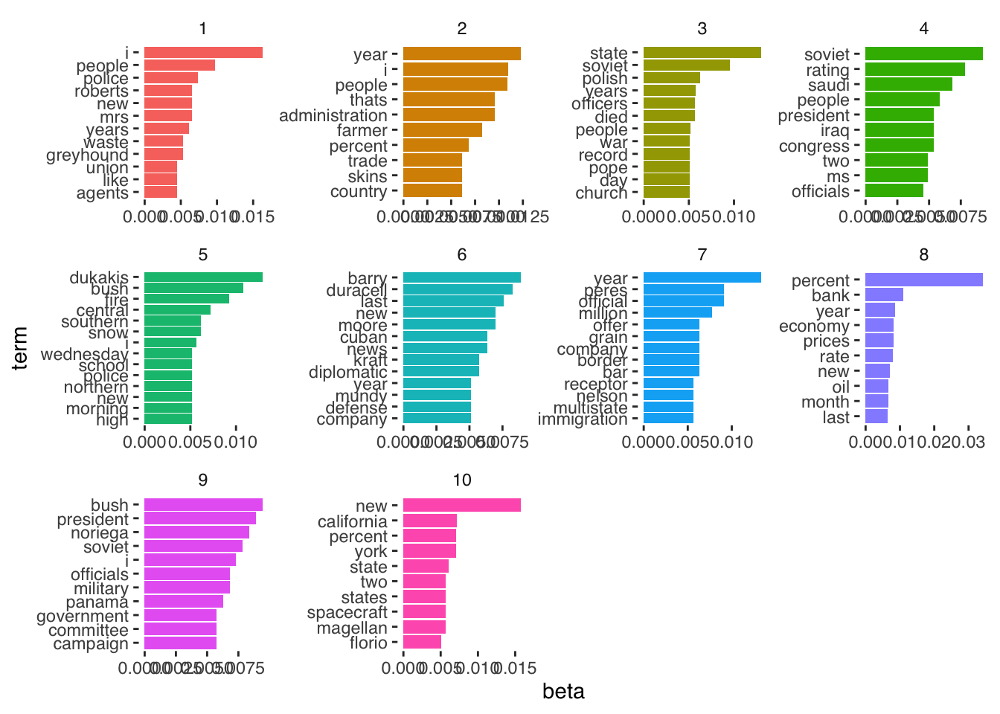

# Week 6 Demo

## Setup

First, we'll load the packages we'll be using in this week's brief demo.


``` r
library(topicmodels)
# there are sometimes problem with installing topicmodels on Mac OS X. You can find help on Ken benoit's page here: https://kenbenoit.net/how-to-install-the-r-package-topicmodels-on-os-x/. For me, this required installing gsl and modeltools.

library(dplyr)
library(tidytext)
library(ggplot2)
library(ggthemes)
library(tidyverse)
library(quanteda)
library(stringr)
```

## Regex exercise

We'll start with a quick regex exercise to practice extracting information from text. For this exercise, we will use the text of the recent emails sent to academic staff by Peter Mathieson


``` r
email1 <- "Dear colleague,

Work is continuing across our five change workstreams to identify savings in our operational spending. This includes costs that are related to both staff and non-staff (“other operating expenditure”).

Staff costs are by far the largest component of our expenditure. Our Staff workstream is addressing this through projects to identify the right size and shape for our academic and professional staff body to deliver our future teaching and research model.

Read the latest on Staff workstream projects

It has always been our approach to take actions that will seek to avoid compulsory redundancies. This commitment is unwavering.

We also continue to honour all terms of our agreement with the University and College Union Edinburgh (UCUE) made in December 2025. This agreement demonstrated what can be achieved with constructive engagement, and we will seek to continue working with our joint trade unions as we take the necessary steps to secure a sustainable future for our University.

Read more about the agreement with UCUE

We are taking action in line with this commitment to help us reduce our costs whilst protecting jobs wherever possible. This includes new measures outlined below.

Academic promotions and professional services job regrading

Academic promotions and regrading of professional services roles remain paused until we reach a more stable financial position. This means that there will be no promotions or regrading processes in 2026/27.
We recognise the concerns about this pause: the decision to extend it for another year has not been taken lightly. We all wish to be able to get back to a situation in which we can return to these processes, but it is responsible leadership to balance this desire with consideration of affordability.

We will review this policy again in 2027, by which time we hope to be able to reinstate the promotions and regrading processes if we are confident that we are in a financial position to accommodate the increased costs associated with these schemes. In the meantime, we are using this intervening period to make improvements to the promotions and regrading schemes, including simplifying our processes and using automation where possible.

The Equality Impact Assessment (EqIA) associated with this decision has been updated and is available to read on our website. We are mindful of the impact of continuing this pause, especially on making further progress towards ensuring diversity within higher grades. We will continue to monitor this and any arising impacts of this decision.  

Read the EqIA

Contribution rewards

Our contribution recognition process was cancelled last year. Work to review and improve future recognition offerings will continue, with plans to replace this process with a scheme which remains fair, rewarding and fit for the future. We will provide further updates on how this work is progressing in the next academic year.

Additional recruitment restraint for higher grade roles

We are continuing to limit recruitment of new and replacement staff posts to only those roles considered critical to the University’s mission. We will now further limit recruitment of staff in grades UE08-10 and equivalent, where we have seen the largest increase in permanent roles over the last few years.
Processes to consider roles within these grades are currently being developed and will likely require approval both within budget areas and by other senior leaders.

Changes to recruitment processes

Where recruitment for new or replacement posts has been approved, these roles must now be advertised internally for two weeks prior to external advertising, with only minor agreed exceptions. This commitment supports our aim to maximise internal career opportunities, while continuing to recruit high-quality staff aligned to prioritised organisational needs.   

More information on this change is available in our updated recruitment guidance.

View the updated recruitment guidance

Voluntary Severance Scheme for academic staff

We are currently offering a Voluntary Severance Scheme which is open to applications from academic staff. Details of this scheme are available on the SharePoint site linked below. This includes answers to common questions and an estimate calculator so you can see what voluntary severance would mean for you financially.

Voluntary Severance Scheme 2026 SharePoint

Thank you to everyone who is working hard to identify savings that will help us meet our cost-savings targets. The senior team and I understand how difficult this period is for everyone within our community. However, through these changes we aim to become a more efficient and resilient institution, focused on our core mission of delivering exceptional teaching and research.

I recognise that there is still uncertainty about some aspects of the measures we are taking to reshape our University, and we will continue to update you on this work as it develops. Please continue to visit the University Finances SharePoint for the latest information and FAQs:

University Finances SharePoint

Best wishes,
Peter"

email2 <- "Dear colleague,

Happy New Year and welcome to the new semester. I hope you enjoyed the festivities and found time to rest over the winter break. As always, my sincere thanks go to those who continued to deliver our essential services over the festive period.
      
Financial sustainability

There is no doubt that 2025 was a busy and challenging year. The ongoing financial challenges facing the University and the entire Higher Education sector are very serious, and I’m acutely aware that this year will bring further uncertainty for many of you while we continue to develop plans to reshape the University and build greater financial sustainability. Our aim is to give people clarity as quickly and fairly as we can.

Our latest annual report and accounts will be published this month, once again demonstrating that our expenditure growth continues to outpace our income growth. We have always been clear that we must take action immediately to address these challenges and indeed the 2024/25 accounts report a modest surplus because of the actions that we took in that financial year. Without those actions, the institution would now already be running at a deficit each month, confirming that delaying difficult decisions would only lead to far greater problems in the future.

Work will continue this year to identify savings in our operational spending through our five change workstreams. The agreement with the University and College Union in December provides clear parameters for the work of our staff workstream moving forward. Our commitment to staff remains that we will continue to take actions with the aim of preventing the need for compulsory redundancies. Where any redundancies are required, we will always provide voluntary options before considering the need for compulsory action. We are also working to ensure that comments and feedback from last year’s staff survey are addressed through our change programme.

Read more on the union agreement

As well as needing to reduce staff costs, we need to reduce non-staff costs, for example in the ways we procure supplies and services. Colleagues in Procurement have identified substantial recurrent savings by careful alignment of our needs and detailed negotiations with suppliers, all without reducing the quality of goods or services.

I want to emphasise that change is not optional: it is absolutely required right across the University and all its activities. For example, in our efforts to reduce non-staff costs (and thereby protect as many jobs as possible) there will be examples where someone might prefer a particular product, online platform or manufacturer’s equipment and have to accept that their preference can no longer be afforded.

Reducing our costs and improving our ways of working will require collective effort from all of us, and we need to work together to successfully deliver the changes needed. This process will be difficult; however, I am confident that through actions already taken and the projects underway to explore how we will work in future, we are well placed to respond to the challenge of restoring financial sustainability and resilience.

We will continue to keep you updated about the changes being made across the University by email and by updates on our dedicated SharePoint sites. There will also be continued opportunities this year for you to feed into these changes directly and to speak to leaders across the University about how they will impact you.

Find information and updates from our workstreams
Visit our University Finances SharePoint

Our continued impact

Despite the ongoing uncertainty, there is so much that we can be proud of and there are many reasons to remain optimistic as we move into 2026. The University is a tremendous force for good and the changes we are making will help us to continue delivering local and global impact this year and long into the future. I’d like to highlight just a few examples.
     
The University has recently been ranked 4th in the world and 2nd in the UK in the 2026 QS World University Rankings for Sustainability. This feels particularly apt as we prepare to launch our new sustainability strategy in the spring, which sets out our plans to not only minimise damage to the environment, but actively repair it. Read more about our sustainability credentials
2026 marks 300 years of medical education at the University - we believe ours to be the oldest medical school in the English-speaking world. The 'Edinburgh Medical School 300’ project will explore Edinburgh’s history in shaping modern medicine and set the stage for future innovations in medical education and healthcare. Get involved in Edinburgh Medical School 300
Our research and innovation outputs continue to go from strength to strength. We were proud to win a Queen Elizabeth Prize for Higher Education last year in recognition of the Centre for Fire Safety Engineering’s education, training and internationally significant research which has for 50 years made built and natural environments safer around the world. Find out more about the award-winning project
Our commercial activity continues to thrive, driven and supported by colleagues in Edinburgh Innovations. We secured £112.6m in research awards in 2024/25, attracted £113m investment into University-associated companies, generated 172 new patents, 62 new licenses and launched 64 companies. Read The Power of Innovation 2024/5
Our new Community Plan was launched last semester, detailing how we will continue to work with our local communities on solutions to the challenges that matter to them. This includes extending our Community Access to Rooms Scheme which, since its launch in 2022, has saved more than 180 local organisations an estimated £55,000 in room hire costs. View our Community Plan
     
Improving staff and student experience

Underpinning our work to reshape the University is our commitment to improving the experience of our students as well as our staff.

I was delighted to see improvements to our performance in last year’s National Student Survey. Our Postgraduate surveys also continue to show positives and we have made good progress in the last year with regard to timeliness of assessment feedback. This is all credit to the hard work of teams across the University and we look forward to capitalising on this progress and making further improvements in 2026.

This spring will also see the reopening of our iconic and much-loved Students’ Union building Teviot after extensive renovation works and improvements to accessibility.  
 
Teviot building works

Thank you

The senior team and University Executive all understand that it’s not an easy time. However, regardless of the challenges we face, there are so many reasons to feel proud of your contributions to the University and our community. I want to thank you for all that you do to continue delivering for our fantastic University.

With best wishes for the new semester.

Peter"

email3 <- "Dear colleague,

Thank you to everyone who came to our recent staff information sessions at EFI, Nucleus and the Chancellor’s Building. It was good to be able to speak directly with a range of staff and hear your passion for and commitment to our University and the work you do.

Your questions in the staff sessions

A few questions came across loud and clear and we wanted to provide clarity and reassurance on these.

Are we in deficit? No, we are not. However, our costs are rising more than our income and if we had not already made some difficult decisions and taken several definitive actions, it is likely that we would by now be in financial deficit. As we can see from other institutions across the sector, this can result in loss of control over our own future. It would certainly prevent us investing in our continued research and teaching success. We want to avoid that through timely, targeted action.
When will this be over? We recognise it is hard not knowing just now how things might change, or how your team or job might be affected. We want to get change right, and of course we properly consult staff where any structural changes might be proposed. Our aim is to be financially stable enough to allow us to invest again in our strategic priorities by August 2027. This means we hope the bulk of staffing reviews and any changes to ways of working will be completed by this point. Some larger projects, for example around infrastructure, will be longer term. We will continue to operate and evolve in an agile way in response to the world around us.
What vision is guiding this work? We are staying true to Strategy 2030 and have set out an interim 2027 milestone as we navigate these challenges. You can read this on the University Finances SharePoint linked below under ‘Reshaping our University’.
How are you tackling the financial pressures affecting higher education? We are in direct contact with the Scottish Government, Universities Scotland and sector colleagues to press for structural challenges and funding shortfalls to be addressed. We are also working via the Russell Group and Universities UK on those aspects of UK Government policy that directly affect us.

We have updated our University Finances SharePoint with additional questions from these sessions, and other questions that colleagues have been raising:

Visit University Finances SharePoint

Update on finances

Many thanks to everyone who has been working so hard to meet our student recruitment targets and to deliver wider cost savings. We are close to our budget forecast on tuition fee income, with notable drops in some areas including postgraduate taught overseas student intake and online learning student intakes. We are holding up well overall, given the increased competition for students across the board.

Reshaping projects progress

Last week, University Executive approved a second round of projects under our five workstreams for reshaping activity. We have now finalised our portfolio of projects for this financial year, and they are being planned and implemented.

You can see the full list and get updates on current and future projects on SharePoint:

Visit Supporting Strategic Initiatives SharePoint

Thank you

We fully acknowledge the anxiety and uncertainty that the current period of change is generating. Our focus is on ensuring our University has a sustainable future and a thriving workforce able to do what they do best – delivering and supporting world-leading research and teaching.

Thank you for all you are contributing to our community and to our successes at this challenging time.

Best wishes,
Peter and Kim"

email4 <- "Dear colleague,

In our update last week, we let you know that information sessions are taking place this semester. These are opportunities for staff to speak to leaders about changes being made across the University to improve our ways of working and reduce costs.

Meetings are already being held within Colleges and Professional Service Groups to discuss how these changes are being delivered in their areas. Three additional meetings will be taking place at various campus locations in November which are open to all staff:

Monday 3 November, 14:00-15:30 – Edinburgh Futures Institute (Central)
Wednesday 5 November, 14:00-15:30 – Nucleus Building (King’s Buildings)
Monday 10 November, 09:30-11:00 – Chancellor’s Building (BioQuarter)

Book your place

What to expect at the sessions

We have been keeping you up to date on the University’s financial position and the changes we are making in response, via regular emails and updates on SharePoint. While no new information or announcements will be shared at these sessions, they offer an opportunity for staff to speak to senior leaders about how we are delivering Strategy 2030 ambitions while reducing our costs and achieving financial sustainability.

The meetings will include a short presentation and Q&A, followed by break-out discussions to speak to leaders involved in some of our change projects. Questions asked at the sessions will inform future updates to you.

Please continue to visit our SharePoint site for the latest information on this work:

Visit the Supporting Strategic Initiatives SharePoint

If you cannot make the sessions, you can still pre-submit a question in advance of the meetings or contact the relevant member of the Senior Leadership Team or change workstream with your query.

Submit a question

We look forward to seeing you there.

Kind regards,

Peter and Kim"
```


``` r
# combine the emails into a single list of documents
emails <- c(email1, email2, email3, email4) %>%
  as_tibble %>%
  # add a variable for row number
  mutate(email = row_number())
```

## Regex exercise

Use Regex and commands from the stringr package (check the online cheatsheet) to extract: - all the numbers - all the dates (e.g., 2026, 2027, 2025/26, etc.) - all the names mentioned in those emails - all the words related to finances (finance, financial, finances, financially, etc.)) and their frequency in each email


``` r
# extract all the numbers
emails %>%
  mutate(numbers = str_extract_all(value, "\\d+")) %>%
  # turn into a list of numbers
  unnest(numbers) %>%
  group_by(email)
```

```
## # A tibble: 53 × 3
## # Groups:   email [4]
##    value                                                           email numbers
##    <chr>                                                           <int> <chr>  
##  1 "Dear colleague,\n\nWork is continuing across our five change …     1 2025   
##  2 "Dear colleague,\n\nWork is continuing across our five change …     1 2026   
##  3 "Dear colleague,\n\nWork is continuing across our five change …     1 27     
##  4 "Dear colleague,\n\nWork is continuing across our five change …     1 2027   
##  5 "Dear colleague,\n\nWork is continuing across our five change …     1 08     
##  6 "Dear colleague,\n\nWork is continuing across our five change …     1 10     
##  7 "Dear colleague,\n\nWork is continuing across our five change …     1 2026   
##  8 "Dear colleague,\n\nHappy New Year and welcome to the new seme…     2 2025   
##  9 "Dear colleague,\n\nHappy New Year and welcome to the new seme…     2 2024   
## 10 "Dear colleague,\n\nHappy New Year and welcome to the new seme…     2 25     
## # ℹ 43 more rows
```


``` r
# extract all the dates
emails %>%
  mutate(dates = str_extract_all(value, "\\d{4}")) %>%
  # turn into a list of numbers
  unnest(dates) %>%
  group_by(email) 
```

```
## # A tibble: 17 × 3
## # Groups:   email [4]
##    value                                                             email dates
##    <chr>                                                             <int> <chr>
##  1 "Dear colleague,\n\nWork is continuing across our five change wo…     1 2025 
##  2 "Dear colleague,\n\nWork is continuing across our five change wo…     1 2026 
##  3 "Dear colleague,\n\nWork is continuing across our five change wo…     1 2027 
##  4 "Dear colleague,\n\nWork is continuing across our five change wo…     1 2026 
##  5 "Dear colleague,\n\nHappy New Year and welcome to the new semest…     2 2025 
##  6 "Dear colleague,\n\nHappy New Year and welcome to the new semest…     2 2024 
##  7 "Dear colleague,\n\nHappy New Year and welcome to the new semest…     2 2026 
##  8 "Dear colleague,\n\nHappy New Year and welcome to the new semest…     2 2026 
##  9 "Dear colleague,\n\nHappy New Year and welcome to the new semest…     2 2026 
## 10 "Dear colleague,\n\nHappy New Year and welcome to the new semest…     2 2024 
## 11 "Dear colleague,\n\nHappy New Year and welcome to the new semest…     2 2024 
## 12 "Dear colleague,\n\nHappy New Year and welcome to the new semest…     2 2022 
## 13 "Dear colleague,\n\nHappy New Year and welcome to the new semest…     2 2026 
## 14 "Dear colleague,\n\nThank you to everyone who came to our recent…     3 2027 
## 15 "Dear colleague,\n\nThank you to everyone who came to our recent…     3 2030 
## 16 "Dear colleague,\n\nThank you to everyone who came to our recent…     3 2027 
## 17 "Dear colleague,\n\nIn our update last week, we let you know tha…     4 2030
```


``` r
emails %>%
  mutate(names = str_extract_all(value, "\\b[A-Z][a-z]+\\b")) %>%
  # turn into a list of numbers
  unnest(names) %>%
  group_by(email) %>%
  select(names)
```

```
## Adding missing grouping variables: `email`
```

```
## # A tibble: 310 × 2
## # Groups:   email [4]
##    email names
##    <int> <chr>
##  1     1 Dear 
##  2     1 Work 
##  3     1 This 
##  4     1 Staff
##  5     1 Our  
##  6     1 Staff
##  7     1 Read 
##  8     1 Staff
##  9     1 It   
## 10     1 This 
## # ℹ 300 more rows
```

``` r
# not enough - that just captures any capitalised word
# let's say we want words that are capitalised and are not at the beginning of a sentence (i.e., not preceded by a full stop)

emails %>%
  mutate(names = str_extract_all(value, "(?<!\\.\\s)\\b[A-Z][a-z]+\\b")) %>%
  # turn into a list of numbers
  unnest(names) %>%
  group_by(email)
```

```
## # A tibble: 239 × 3
## # Groups:   email [4]
##    value                                                             email names
##    <chr>                                                             <int> <chr>
##  1 "Dear colleague,\n\nWork is continuing across our five change wo…     1 Dear 
##  2 "Dear colleague,\n\nWork is continuing across our five change wo…     1 Work 
##  3 "Dear colleague,\n\nWork is continuing across our five change wo…     1 Staff
##  4 "Dear colleague,\n\nWork is continuing across our five change wo…     1 Staff
##  5 "Dear colleague,\n\nWork is continuing across our five change wo…     1 Read 
##  6 "Dear colleague,\n\nWork is continuing across our five change wo…     1 Staff
##  7 "Dear colleague,\n\nWork is continuing across our five change wo…     1 It   
##  8 "Dear colleague,\n\nWork is continuing across our five change wo…     1 We   
##  9 "Dear colleague,\n\nWork is continuing across our five change wo…     1 Univ…
## 10 "Dear colleague,\n\nWork is continuing across our five change wo…     1 Coll…
## # ℹ 229 more rows
```

``` r
# still doesn't work because a lot of words are preceded by e.g. paragraph breaks.
# let's have a look at our text again, we might be able to find patterns, e.g. "Mr", "Dr", "Professor", etc
# As it happens there are very few names in these emails - only the signatures. So how would we capture those? Maybe the last line of the email?

#extract the signature (i.e. the last line of each text)
emails %>%
  mutate(signature = str_extract(value, "\\w+\\z")) 
```

```
## # A tibble: 4 × 3
##   value                                                          email signature
##   <chr>                                                          <int> <chr>    
## 1 "Dear colleague,\n\nWork is continuing across our five change…     1 Peter    
## 2 "Dear colleague,\n\nHappy New Year and welcome to the new sem…     2 Peter    
## 3 "Dear colleague,\n\nThank you to everyone who came to our rec…     3 Kim      
## 4 "Dear colleague,\n\nIn our update last week, we let you know …     4 Kim
```

``` r
emails %>%
  mutate(signature = str_extract(value, "\\b(.*)$")) %>%
  select(signature)
```

```
## # A tibble: 4 × 1
##   signature    
##   <chr>        
## 1 Peter        
## 2 Peter        
## 3 Peter and Kim
## 4 Peter and Kim
```

## Topic model demo

Estimating a topic model requires us first to have our data in the form of a document-term-matrix. This is another term for what we have referred to in previous weeks as a document-feature-matrix.

We can take some example data from the `topicmodels` package. This text is from news releases by the Associated Press. It consists of around 2,200 articles (documents) and over 10,000 terms (words).


``` r
data("AssociatedPress", 
     package = "topicmodels")
```

To estimate the topic model we need only to specify the document-term-matrix we are using, and the number (`k`) of topics that we are estimating. To speed up estimation, we are here only estimating it on 100 articles.


``` r
lda_output <- LDA(AssociatedPress[1:100,], k = 10)
```

We can then inspect the contents of each topic as follows.


``` r
terms(lda_output, 10)
```

```
##       Topic 1     Topic 2          Topic 3    Topic 4     Topic 5   
##  [1,] "i"         "year"           "state"    "soviet"    "dukakis" 
##  [2,] "people"    "i"              "soviet"   "rating"    "bush"    
##  [3,] "police"    "people"         "polish"   "saudi"     "fire"    
##  [4,] "mrs"       "administration" "years"    "people"    "central" 
##  [5,] "new"       "thats"          "died"     "congress"  "snow"    
##  [6,] "roberts"   "farmer"         "officers" "iraq"      "southern"
##  [7,] "years"     "percent"        "people"   "president" "i"       
##  [8,] "greyhound" "country"        "church"   "ms"        "high"    
##  [9,] "waste"     "skins"          "day"      "two"       "morning" 
## [10,] "agents"    "trade"          "pope"     "officials" "new"     
##       Topic 6      Topic 7       Topic 8   Topic 9     Topic 10    
##  [1,] "barry"      "year"        "percent" "bush"      "new"       
##  [2,] "duracell"   "official"    "bank"    "president" "california"
##  [3,] "last"       "peres"       "year"    "noriega"   "percent"   
##  [4,] "moore"      "million"     "economy" "soviet"    "york"      
##  [5,] "new"        "border"      "prices"  "i"         "state"     
##  [6,] "cuban"      "company"     "rate"    "military"  "magellan"  
##  [7,] "news"       "grain"       "new"     "officials" "spacecraft"
##  [8,] "diplomatic" "offer"       "oil"     "panama"    "states"    
##  [9,] "kraft"      "bar"         "month"   "campaign"  "two"       
## [10,] "company"    "immigration" "last"    "committee" "florio"
```

We can then use the `tidy()` function from `tidytext` to gather the relevant parameters we've estimated. To get the $\beta$ per-topic-per-word probabilities (i.e., the probability that the given term belongs to a given topic) we can do the following.


``` r
lda_beta <- tidy(lda_output, matrix = "beta")

lda_beta %>%
  arrange(-beta)
```

```
## # A tibble: 104,730 × 3
##    topic term      beta
##    <int> <chr>    <dbl>
##  1     8 percent 0.0343
##  2     1 i       0.0163
##  3    10 new     0.0158
##  4     7 year    0.0134
##  5     3 state   0.0130
##  6     5 dukakis 0.0129
##  7     2 year    0.0123
##  8     8 bank    0.0110
##  9     2 i       0.0109
## 10     2 people  0.0109
## # ℹ 104,720 more rows
```

And to get the $\gamma$ per-document-per-topic probabilities (i.e., the probability that a given document (here: article) belongs to a particular topic) we do the following.


``` r
lda_gamma <- tidy(lda_output, matrix = "gamma")

lda_gamma %>%
  arrange(-gamma)
```

```
## # A tibble: 1,000 × 3
##    document topic gamma
##       <int> <int> <dbl>
##  1       76     2 1.000
##  2       81     3 1.000
##  3        6     9 1.000
##  4       43     1 1.000
##  5       95    10 1.000
##  6       77     5 1.000
##  7       29     3 1.000
##  8       80     3 1.000
##  9       57     4 1.000
## 10       25     8 1.000
## # ℹ 990 more rows
```

And we can easily plot our $\beta$ estimates as follows.


``` r
lda_beta %>%
  group_by(topic) %>%
  top_n(10, beta) %>%
  ungroup() %>%
  arrange(topic, -beta) %>%
  mutate(term = reorder_within(term, beta, topic)) %>%
  ggplot(aes(beta, term, fill = factor(topic))) +
  geom_col(show.legend = FALSE) +
  facet_wrap(~ topic, scales = "free", ncol = 4) +
  scale_y_reordered() +
  theme_tufte(base_family = "Helvetica")
```



Which shows us the words associated with each topic, and the size of the associated $\beta$ coefficient.
