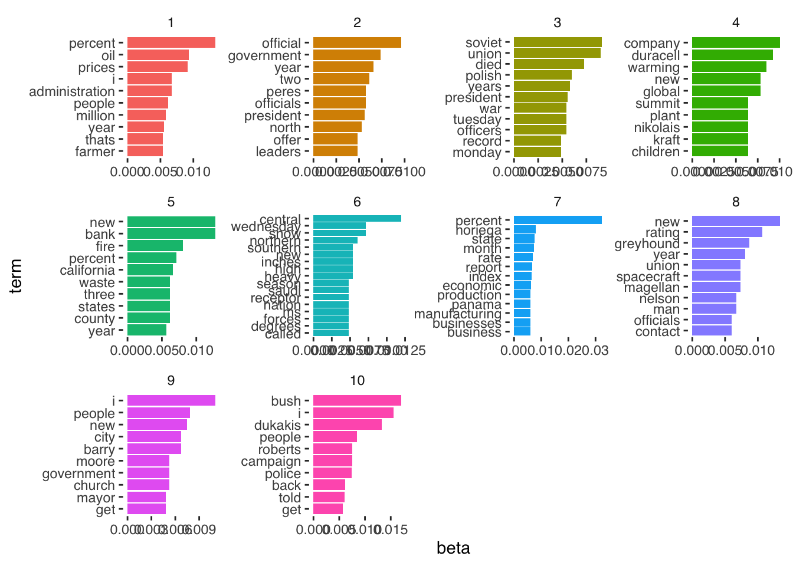

# Week 6 Demo

## Setup
First, we'll load the packages we'll be using in this week's brief demo. 


``` r
library(topicmodels)
# there are sometimes problem with installing topicmodels on Mac OS X. You can find help on Ken benoit's page here: https://kenbenoit.net/how-to-install-the-r-package-topicmodels-on-os-x/. For me, this required installing gsl and modeltools.

library(dplyr)
library(tidytext)
library(ggplot2)
library(ggthemes)
library(tidyverse)
```

Estimating a topic model requires us first to have our data in the form of a document-term-matrix. This is another term for what we have referred to in previous weeks as a document-feature-matrix.

We can take some example data from the `topicmodels` package. This text is from news releases by the Associated Press. It consists of around 2,200 articles (documents) and over 10,000 terms (words).


``` r
data("AssociatedPress", 
     package = "topicmodels")
```

To estimate the topic model we need only to specify the document-term-matrix we are using, and the number (`k`) of topics that we are estimating. To speed up estimation, we are here only estimating it on 100 articles.


``` r
lda_output <- LDA(AssociatedPress[1:100,], k = 10)
```

We can then inspect the contents of each topic as follows.


``` r
terms(lda_output, 10)
```

```
##       Topic 1          Topic 2      Topic 3     Topic 4    Topic 5     
##  [1,] "percent"        "official"   "soviet"    "company"  "bank"      
##  [2,] "oil"            "government" "union"     "duracell" "new"       
##  [3,] "prices"         "year"       "died"      "warming"  "fire"      
##  [4,] "administration" "two"        "polish"    "new"      "percent"   
##  [5,] "i"              "officials"  "years"     "global"   "california"
##  [6,] "people"         "peres"      "president" "children" "county"    
##  [7,] "million"        "president"  "officers"  "kraft"    "states"    
##  [8,] "year"           "north"      "tuesday"   "nikolais" "three"     
##  [9,] "farmer"         "leaders"    "war"       "plant"    "waste"     
## [10,] "thats"          "offer"      "monday"    "summit"   "year"      
##       Topic 6     Topic 7      Topic 8      Topic 9      Topic 10  
##  [1,] "central"   "percent"    "new"        "i"          "bush"    
##  [2,] "snow"      "noriega"    "rating"     "people"     "i"       
##  [3,] "wednesday" "state"      "greyhound"  "new"        "dukakis" 
##  [4,] "northern"  "month"      "year"       "barry"      "people"  
##  [5,] "heavy"     "rate"       "magellan"   "city"       "campaign"
##  [6,] "high"      "report"     "spacecraft" "church"     "roberts" 
##  [7,] "inches"    "index"      "union"      "government" "police"  
##  [8,] "new"       "economic"   "man"        "moore"      "back"    
##  [9,] "southern"  "business"   "nelson"     "get"        "told"    
## [10,] "called"    "businesses" "contact"    "mayor"      "get"
```

We can then use the `tidy()` function from `tidytext` to gather the relevant parameters we've estimated. To get the $\beta$ per-topic-per-word probabilities (i.e., the probability that the given term belongs to a given topic) we can do the following.


``` r
lda_beta <- tidy(lda_output, matrix = "beta")

lda_beta %>%
  arrange(-beta)
```

```
## # A tibble: 104,730 × 3
##    topic term      beta
##    <int> <chr>    <dbl>
##  1     7 percent 0.0323
##  2    10 bush    0.0170
##  3    10 i       0.0156
##  4     8 new     0.0134
##  5     1 percent 0.0133
##  6    10 dukakis 0.0132
##  7     5 bank    0.0127
##  8     5 new     0.0127
##  9     6 central 0.0120
## 10     9 i       0.0110
## # ℹ 104,720 more rows
```

And to get the $\gamma$ per-document-per-topic probabilities (i.e., the probability that a given document (here: article) belongs to a particular topic) we do the following.


``` r
lda_gamma <- tidy(lda_output, matrix = "gamma")

lda_gamma %>%
  arrange(-gamma)
```

```
## # A tibble: 1,000 × 3
##    document topic gamma
##       <int> <int> <dbl>
##  1       76     1 1.000
##  2       81     9 1.000
##  3        6     7 1.000
##  4       43    10 1.000
##  5       95     5 1.000
##  6       77    10 1.000
##  7       29     3 1.000
##  8       80     3 1.000
##  9       57     2 1.000
## 10       25     5 1.000
## # ℹ 990 more rows
```

And we can easily plot our $\beta$ estimates as follows.


``` r
lda_beta %>%
  group_by(topic) %>%
  top_n(10, beta) %>%
  ungroup() %>%
  arrange(topic, -beta) %>%
  mutate(term = reorder_within(term, beta, topic)) %>%
  ggplot(aes(beta, term, fill = factor(topic))) +
  geom_col(show.legend = FALSE) +
  facet_wrap(~ topic, scales = "free", ncol = 4) +
  scale_y_reordered() +
  theme_tufte(base_family = "Helvetica")
```



Which shows us the words associated with each topic, and the size of the associated $\beta$ coefficient. 
